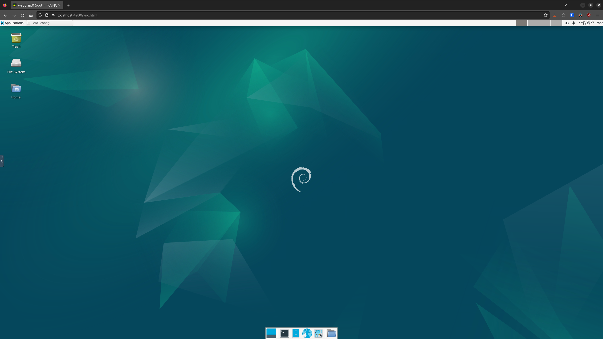

# Webbian - Linux VMs in Docker on the Web

A web accessible Virtual Machine powered by Docker, Debian, and noVNC. Webbian allows you to execute a single `docker run` command to get an entire linux system with a web interface.

Read the docs at: https://nowsci.com/webbian
